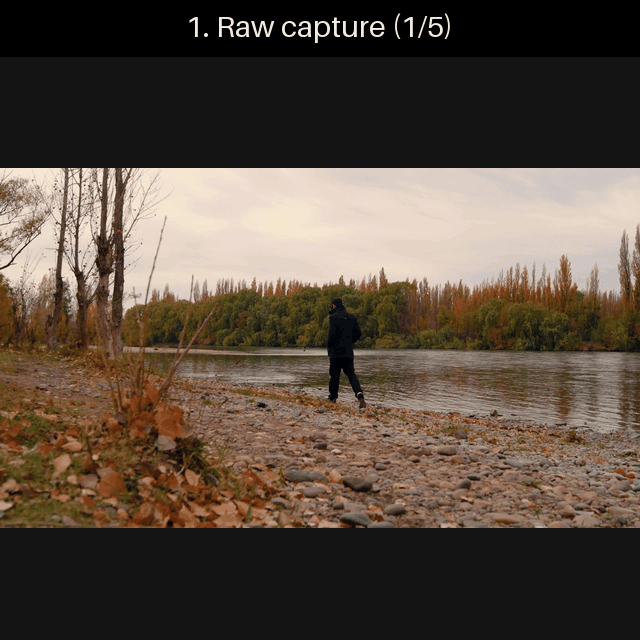

# Projection Sorcery

This project uses a webcam or robot (camera + Dynamixel motor rig) to capture a short burst of frames of a person moving, builds a motion trail out of them, then restyles the result as a dark shōnen anime illustration via an image-editing API call.

It's inspired by Naoya Zenin's projection sorcery cursed technique from Jujutsu Kaisen.

For demo purposes, I asked Claude Code to add a `--video` flag to the pipeline so it can read frames from an uploaded video instead of a live camera, and ran some royalty-free stock footage through it. Footage: [Matias_Luge](https://pixabay.com/users/matias_luge-4388604/) via [Pixabay](https://pixabay.com/).

## Pipeline

1. **Capture** — take `NUM_FRAMES` frames over `CAPTURE_DURATION_S` seconds
2. **Pose** — uses YOLO pose detection to form an evenly spaced trail
3. **Segment** — uses YOLO segmentation to cut the person out of each frame
4. **Stabilize** — computes a homography so all frames share one camera frame of reference
5. **Composite** — layers the cutouts onto the newest frame, with older ones faded
6. **Anime** — calls OpenAI `images.edit` to restyle the whole composite; see
   `ANIME_PROMPT` in `config.py` for the exact style spec

## Requirements

- Python 3.12+, [uv](https://docs.astral.sh/uv/).
- An OpenAI API key with image-edit access — copy `.env.example` to `.env` and fill it in.
- **Local-only dependency**: `pyproject.toml` pulls in the `gretchen` robot-driver package
  from a path outside this repo. This won't
  resolve for anyone else cloning the project — either vendor/publish that dependency
  separately, or note that the robot-driving parts require it and the CV/anime pipeline
  alone does not.
- For the full robot pipeline: a webcam and a Gretchen motor rig connected over USB serial
  (device paths configured in `config.py`).

## Running

- `uv sync` — install dependencies.
- `uv run projection-sorcery` — full pipeline (capture → ... → anime).
  - `--skip-anime` — stop before the billable image-edit call.
  - `--no-debug` — don't write intermediate frames to `debug_output/`.
  - `--video PATH` — read frames from an uploaded video file instead of the live camera;
    `NUM_FRAMES` frames are sampled evenly across the whole clip.
- Individual stages can also be run standalone against `debug_output/`, e.g.
  `uv run python -m projection_sorcery.anime` restyles whatever composite is already
  sitting in `debug_output/composite/`.

## Config

Tunable constants (trail selection thresholds, opacity curve, anime model/prompt, device
paths) live in `src/projection_sorcery/config.py`.

## License

MIT — see `LICENSE`.
